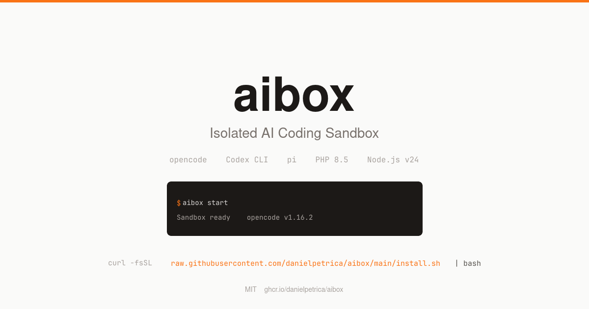

# aibox



Isolated sandbox for AI coding tools. Run opencode, Codex CLI, or pi inside Docker. Your host credentials and filesystem stay safe.

---

## What is this?

aibox wraps AI coding tools in a Docker container. You type `aibox start` instead of `opencode`, and your AI coding session runs inside a sandbox. The container has Node.js, PHP, git, and three AI coding CLI tools pre-installed. No host SSH keys, no AWS credentials, no `.env` files from other projects -- only the directory you're standing in is visible inside the container.

When you're done, the container disappears. Nothing persists. Every session starts clean.

## Why

AI coding tools execute arbitrary commands on your machine. They run `npm install`, `composer update`, shell scripts, build systems, test suites. If you point one at a repository you don't fully trust -- a client codebase, a random GitHub project you're evaluating, an open source PR you're reviewing -- the tool is running that code with access to your entire filesystem and every credential on your machine.

Docker provides a hard boundary. Non-root user, no `--privileged`, only the current directory mounted. The blast radius is limited to the repo itself. Your `~/.ssh`, `~/.aws`, browser cookies, password manager -- none of it exists inside the container unless you explicitly opt in.

This isn't security theater. AI coding tools have real attack surface, and most people run them on bare metal without thinking about it.

## Philosophy

**Secure by default.** Nothing from the host is mounted unless you opt in. No `.gitconfig`, no opencode config, no environment variables. You decide what crosses the boundary.

**Zero friction.** One command to install. One command to start. No remembering Docker flags, no manual setup. `aibox start` is muscle-memory simple.

**Tool-agnostic.** Not just opencode. Codex CLI and pi are bundled too. Use whichever tool fits the task. The sandbox doesn't care.

**Stateless.** The container is destroyed on exit. No lingering processes, no leftover volumes, no state to clean up. Every session is a fresh environment.

**Clean codebase.** The repo root has 4 files: the script, the installer, the license, and this readme. Docker config lives in `.docker/`. CI lives in `.github/`. No clutter.

**Open source, not open core.** MIT license. No premium tier, no enterprise upsell, no telemetry. This is a tool, not a business.

## How it works

```
aibox start
  -> docker run -it --rm
     -v $(pwd):/workspace          # only current dir visible
     -v ~/.gitconfig (opt-in)      # git identity, if you allowed it
     -v ~/.config/opencode (opt-in) # API keys, if you accepted the risk
     -v ~/.local/share/opencode/auth.json (opt-in, shared, ro) # host credentials
     -v ~/.config/aibox/auth.json  (opt-in, isolated, rw/ro)   # container-only credentials
     --entrypoint opencode         # default tool
     ghcr.io/danielpetrica/aibox:latest
```

The image is pre-built with Ubuntu 26.04 LTS, Node.js v24, PHP 8.5, git, build tools, and three AI coding CLIs. It's published automatically to GitHub Container Registry when a version tag is pushed.

`aibox install` asks about mounting gitconfig, opencode config, opencode auth (login persistence), and which shell. Your answers are saved to `~/.config/aibox/config` and never asked again.

`aibox update` pulls the latest image. `aibox clean --image` wipes everything.

## Install

```bash
curl -fsSL https://raw.githubusercontent.com/danielpetrica/aibox/main/install.sh | bash
```

This downloads `aibox` to `~/.local/bin/`, adds it to your PATH, and runs the setup wizard.

## Usage

```bash
aibox start                     # opencode (default)
aibox start -p "refactor auth"  # opencode with prompt
aibox codex                     # Codex CLI
aibox pi                        # pi
aibox shell                     # interactive bash
aibox run npm test              # run anything
aibox run php artisan migrate   # Laravel workflows
```

## Commands

| Command | |
|---|---|
| `aibox start [args]` | opencode |
| `aibox codex [args]` | Codex CLI |
| `aibox pi [args]` | pi |
| `aibox run <cmd>` | any command inside the sandbox |
| `aibox shell` | interactive bash shell |
| `aibox install` | setup alias and preferences |
| `aibox update` | pull latest image |
| `aibox clean [--image]` | remove containers (and image) |
| `aibox build` | build image locally from source |
| `aibox version` | show version info |

## What's inside

| Tool | Purpose | License |
|---|---|---|
| opencode | AI coding CLI | MIT |
| Codex CLI | OpenAI coding agent | Apache 2.0 |
| pi | peer-to-peer coding agent | MIT |
| Node.js v24 | JavaScript runtime | MIT |
| PHP 8.5 (phpvm) | PHP runtime | MIT |
| bun | JS runtime / package manager | MIT |
| pnpm | package manager | MIT |
| yarn | package manager | BSD-2-Clause |
| git | version control | GPLv2 |

Claude Code is proprietary (Anthropic, all rights reserved) and cannot be redistributed. Install it manually inside the container if you have a license.

## Update

```bash
aibox update
```

Images are built and published automatically when a git tag is pushed. `:latest` always tracks the most recent release. Pin to a version with `:v0.1.0` if you need stability.

## Build from source

```bash
git clone https://github.com/danielpetrica/aibox.git
cd aibox
./aibox build
```

## Requirements

Docker. That's it.

## License

MIT
